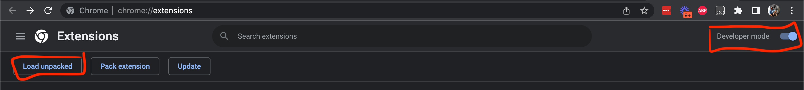
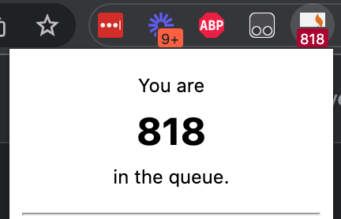

# Kiwiburn STEP checker

Are you tired of ravenously refreshing Quicket.com to see your place in the STEP queue?

Now you can be constantly reminded of exactly how far away you are from your dreams! 🌈✨

## Installation

1) Download a zip file of this repository by visiting this link:
https://github.com/gdpelican/KiwiburnStepChecker/zipball/main

    Unzip this file anwhere that's convenient on your computer

3) Visit `chrome://extensions` in your chrome web browser, and click on 'Load Unpacked'. Select the unzipped folder.

    

    You should see a Kiwiburn icon appear on your extension bar, likely on the top right of your browser.

4) **!! Important !!** Open a new web page (can be anything!). The initial load won't work while you're still viewing the Extensions page.

5) Enter your credentials for Quicket into the login form

    

6) Voila! You should now see your status in the STEP queue from the comfort of anywhere on the internet!

    

7) If you're one of the lucky ones who end up making it to the top of the queue, you'll see a 'Buy Ticket' link which will take you directly to Quicket's site to purchase your ticket.

    

## Troubleshooting

The STEP queue will update approximately once an hour, and each time you re-open your browser. If it's causing trouble for any reason, or you want to know the absolute latest number you can also manually refresh by clicking 'Refresh now' in the extension popup.

If the number isn't loading immediately, try opening a new page and navigating to a web page (can be anything that starts with `https`), then clicking on the 'Refresh now' button.

## Security

This stores your email address and a _very_ lightly hashed version of your password in localStorage on your machine. It does not send that information to any other servers. This is Good Enough™ for me for the limited use case this extension serves; if that's not the case for you, you're welcome to not use this! You should be encrypting your hard drive, and locking your computer when you're away from it.

